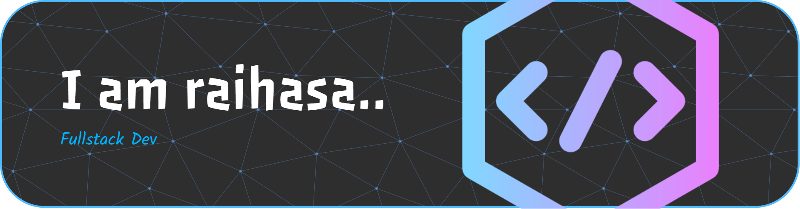

<!-- PROFIL GITHUB README -->

<h1 align="center">👋 Hi, &lt;coders/&gt;</h1>

<h3 align="center">🏫 Student | 💻 Fullstack | 🚀 Lifelong Learner</h3>

---

### 🧠 About Me

- 🔭 I’m currently learning **Web Development** (HTML, CSS, PHP, MySQL)
- 🧱 I also love building worlds in **Minecraft** (especially creative builds!)
- 🌱 I’m improving my skills in **backend logic and database management**
- 🎯 My goal: become a full-stack developer and create interactive experiences

---

### ⚙️ Tech Stack

            

### 📊 GitHub Stats

  
  

---

### 🏆 Achievements

  

---

### 🌐 Connect With Me

---

### 🕹 Fun Fact

> “Coding is like Minecraft — you start with nothing, build step by step, and one day you’ve created a whole new world.”

---

<!-- FOOTER -->

  

